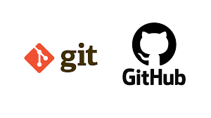

Readme
# Trabajo individual

Mauricio Alail Cano Gutierrez

## Clase 1

### ¿Que es GIT?

Es un sistema de codigo abierto el cual sirve para guardar archivos el gual sirve para desarrolladores trabajar grupalmente

### ¿Como nacio git?

Fue creado por Linus Torvalds debido a la necesidad de un sistema tras salir de Bykeeper

### ¿Como instalar GIT?

En la terminal con el comando:sudo apt-get install git

### Configuraciones basicas

Git config --global user.name "name"
git config --global user.email

Recien hice por que con windows no me dejo editar con nano y de ahi instale debian y trabajo de 8am a 6pm xdxd no tengo tiempo xdxd

## CLASE 2

### LOS ESTADOS DEL GIT

Directorio de Trabajo (Modificado): Es tu carpeta local donde editas los archivos. Los cambios están ahí, pero Git aún no los ha registrado formalmente.

Stage Area (Preparado): Es el área de espera. Aquí seleccionas qué cambios específicos quieres incluir en tu próxima "foto" o versión del proyecto.

Repositorio Local (Confirmado): Los cambios se guardan permanentemente en la base de datos de Git. Cada conjunto de cambios recibe un ID único (hash) y ya forma parte del historial oficial.

### DIRECTORIO DE TRABAJO(MODIFICADO)

Untracked (Sin seguimiento): Archivos nuevos que Git detecta pero que nunca han sido guardados en el historial.

Modified (Modificado): Archivos que ya existían en el historial, pero que has editado, borrado o renombrado.

Cualquier archivo que no esté explícitamente excluido en el .gitignore entrará automáticamente en uno de estos dos estados en cuanto realices un cambio.

### DIRECTORIO DE TRABAJO (MODIFICADO)

QUE PASE A SU ESTADO ORIGINAL "git restore <ARCHIVO>" borra lo que se escribio

PARA QUE EL ARCHIVO CREADO NO LO VEA GIT ES "nombre_del_archivo .gitignore

### STAGE AREA (PREPARADO)

Es el espacio donde seleccionas qué archivos modificados quieres incluir en tu próximo guardado (commit) y cuáles prefieres dejar fuera por ahora.

git add <archivo>: Agrega un archivo específico.

git add .: Agrega todos los archivos modificados o nuevos de una sola vez.

### REPOSITORIO LOCAL (CONFIRMADO)

Es donde al repositorio se cree un punto de guardado para que todos los cambios esten en el staged esten en el historial

      git commit -m "mensaje"
si se quiere deshacer el ultimo commit el comando es;
      git reset --soft HEAD~1

### BUENAS PRACTICAS

Cada commit debe representar un único cambio lógico, que sea pequeño y esté completo.

La regla de oro es que cada commit no debe dejar el proyecto sin funcionar

Dividir las tareas en pequeñas partes para guardarlas y poder revertir si algo sale mal

Add: Para archivos o funciones nuevas.

Change: Para modificar algo que ya existía.

Fix: Para correcciones de errores (bugs).

Remove: Para eliminar elementos.

EL titulo del commit no debe de ser largo max 50 caracteres

Commits Semánticos (Prefijos)

Para que el historial sea fácil de leer, usa una estructura con prefijos que indiquen qué tipo de cambio que se esta  haciendo

Prefijos:
feat: para una nueva característica para el usuario.

fix: para un bug que afecta al usuario.

perf: para cambios que mejoran el rendimiento del sitio.

build: para cambios en el sistema de build, tareas de despliegue o instalación.

ci: para cambios en la integración continua.

docs: para cambios en la documentación.

refactor: para refactorización del código como cambios de nombre de variables o funciones.

style: para cambios de formato, tabulaciones, espacios o puntos y coma, etc; no afectan al
usuario.

test: para tests o refactorización de uno ya existente.

## CLASE 3(GITHUB Y SHH)

### ¿QUE Es GIT?

Es basicamente el sistema que manejas desde tu propia computadora para llevar el control de todas las versiones de tus archivos y crear "puntos de guardado" constantes por si algo sale mal.

### ¿QUE ES GIT HUB?

Es la plataforma en la nube donde subes esos proyectos para que estén seguros y puedas colaborar con otros desarrolladores fácilmente.

### HTTPS

HTTPS es súper pesado porque cada vez que quieres clonar o subir algo te pide el token o la contraseña, lo que corta todo el ritmo de trabajo y se vuelve muy molesto.

### SSH

SSH generas una llave única en tu computadora, la vinculas con GitHub y te olvidas de las validaciones constantes

### Configuración SSH

En la terminal ejecutamos los siguientes comandos

ssh-keygen -t ed25519 -C “tu-correo@email.com”

cat ~/.ssh/id_ed25519.pub

### CREAR UN REPOSITORIO EN GIT HUB

En repositorios darle a new y en create repository

### CONECTAR UN REPOSITORIO LOCAL DE GIT EXISTENTE CON UNO DE GIT HUB

git remote add origin git@github.com:TuUser/TuRepo.git

git branch -M main

git push -u origin main

Para esto ya se deberia haber utilizado el comando git init y tener un commit inicial

### CLONAR UN REPOSITORIO GIT

git clone “git@github.com:TuUser/TuRepo.git

Comando para cambiar el puntero de github y no te
pida autenticación cada vez:

git remote set-url origin “git@github.com:TuUser/TuRepo.git”

/*Este comando también se usa si quieres cambiar el
repositorio remoto al cual esta conectado el repo*/

Si quieres ver a que repositorio remoto esta conectado tu
repo:

git remote -v

Para subir tus avances usas git push, que básicamente es "empujar" tus commits al servidor origin, directo a la rama en la que estás trabajando. En cambio, cuando necesitas bajar las actualizaciones que otros subieron, usas git pull para traerte esos cambios desde el servidor hacia tu propia compu. Es la forma sencilla de mantener sincronizado lo que tienes tú con lo que está guardado en GitHub para que nada se pierda.

### CLASE 4 REMOTE.SHH MULTIPLE Y CHECKOUT

Git Remote es el comando que sirve para gestionar las conexiones entre tu proyecto local y los repositorios en la nube, básicamente le dice a Git hacia dónde debe apuntar para enviar o recibir archivos.

Git Remote -v te permite ver las direcciones URL exactas que tienes configuradas para saber a qué servidor estás conectado actualmente.

Git Remote Add se usa para vincular por primera vez tu carpeta local con un repositorio en la nube dándole un apodo, que generalmente es "origin".

Git Remote Set-url es el que utilizas cuando necesitas cambiar o actualizar la dirección de un repositorio que ya habías vinculado antes.

### MULTIPLE SSH

Lo ideal es tener múltiples llaves SSH para que cada una funcione como un acceso independiente y no haya conflictos entre ellas. Es como tener una llave distinta para cada puerta: te da mucha más seguridad y orden, ya que cada cuenta tiene su propio "túnel" privado para conectar tu compu con el servidor.

### CONFIGURACIONES LOCALES

Las configuraciones locales son las que mandan sobre todas las demás, pero solo funcionan dentro del repositorio donde las activas. Básicamente, sirven para que un proyecto específico tenga sus propios datos sin mover nada de tu configuración general.

Para hacerlo, usas los comandos de nombre y correo pero quitando el flag --global. Así, Git entiende que esos cambios son solo para esa carpeta. En la pirámide de prioridades, lo local siempre está por encima de lo global y lo del sistema, así que es la clave para personalizar cada entrega por separado.

### GIT CHECKOUT

El comando git checkout es básicamente tu máquina del tiempo en Git; sirve para mover el "lector" (el HEAD) hacia cualquier punto de la historia o para saltar entre ramas.

Lo usas para inspeccionar versiones viejas de tu código, restaurar archivos que borraste por error o para experimentar con cambios nuevos sin arruinar la rama principal. También es el comando clave para cambiar de una rama a otra, como cuando pasas de "main" a "desarrollo" para seguir trabajando.

### EL ESTADO DETACHED HEAD

El estado Detached HEAD ocurre cuando dejas de apuntar a una rama y pasas a apuntar directamente a un commit específico. Es como ser un fantasma en el pasado: puedes ver todo lo que pasó y hacer pruebas, pero no tienes un "cuerpo" o rama que sostenga esos cambios.

Lo más importante es que, si haces cambios en este estado y regresas al presente sin crear una rama nueva, todo lo que hiciste se perderá en el vacío. Básicamente, sirve para inspeccionar el código de antes sin el riesgo de arruinar tus ramas actuales.

### COMO VOLVER A UN COMMIT

Para viajar al pasado usas git checkout seguido del código (hash) de ese commit; para regresar al presente, simplemente haces git checkout al nombre de tu rama (como main). Ten cuidado: si haces cambios en el pasado, estos desaparecerán a menos que crees una rama nueva ahí mismo con git checkout -b.

## CLASE 5 (RAMAS Y GITFLOW BASICO)

### ¿QUE SON LAS RAMAS?

Las ramas en Git son como caminos separados del mismo proyecto. Permiten trabajar en cambios o nuevas funciones sin afectar el código principal, y luego unir esos cambios cuando estén listos. Son útiles para organizar y controlar mejor el desarrollo del código.

Git Branch es un comando que permite administrar las ramas de un proyecto.

git branch → Muestra las ramas existentes y en cuál estás trabajando.

git branch nombre-rama → Crea una nueva rama.

git branch -D nombre-rama → Elimina una rama.

### GIT CHECKOUT ENFOCADO EN RAMAS

Git Checkout también sirve para trabajar con ramas:

git checkout nombre-rama → Cambia a otra rama.

git checkout -b nombre-rama → Crea una nueva rama y te mueve a ella de inmediato.

### Git Checkout vs Git Switch

Ambos sirven para cambiar de ramas, pero git checkout es un comando más completo y antiguo: permite cambiar ramas, ir a commits pasados y restaurar archivos.

git switch es más nuevo (desde 2019) y está enfocado solo en manejar ramas, siendo más simple y evitando errores como Detached HEAD.

### GITFLOW BASICO

Gitflow Básico es una forma organizada de trabajar con ramas en Git. Usa reglas para manejar cambios, versiones y desarrollo en equipo, facilitando el orden del proyecto y la colaboración entre varias personas.

### ¿COMO FUNCIONA GITFLOW?

Main → Rama principal que contiene el código estable o en producción.

Develop → Rama donde se integran y prueban nuevas funciones antes de pasar a producción.

Ramas de apoyo → Ramas para trabajar cambios específicos:

Feature: nuevas funciones.

Release: preparación de nuevas versiones.

Hotfix: correcciones urgentes en producción.

### RAMAS DE APOYO

eature → Se usan para desarrollar nuevas funciones del proyecto. Nacen desde develop, luego se integran ahí y se eliminan.
Ejemplo: feature/login, feature/new-form-user.

Release → Se usan para preparar una nueva versión, hacer pruebas y dejar todo listo para producción. Se crean desde develop y luego se fusionan con main y develop.
Ejemplo: release/v1.0.0.

Hotfix → Sirven para corregir errores urgentes en producción. Se crean desde main y luego se fusionan con main y develop.
Ejemplo: hotfix/security-patch.

## CLASE 6

### Git merge

Es básicamente unir ramas. Sirve para combinar los cambios de una rama con otra, por ejemplo llevar lo que hiciste en tu rama a develop.

El --no-ff se usa para que Git no “simplifique” la unión y así quede registrado el merge como un commit aparte, manteniendo mejor el historial.

### Git fetch

Este comando revisa si hay cambios en el repositorio remoto, pero no los descarga a tu código todavía. Solo actualiza la info para que sepas si hay algo nuevo.

### Git pull

Aquí sí traes los cambios del repositorio remoto a tu proyecto. Es como hacer un fetch + merge en un solo paso.

### Git push

Sirve para subir tus cambios al repositorio remoto.

Cuando subes una rama por primera vez, usas -u para que Git la reconozca y no tengas que especificarla siempre.

### Flujo de trabajo sencillo (sin Pull Request)

1. Te cambias a develop y lo actualizas (fetch + pull).
2. Vuelves a tu rama y haces merge de develop (solo si hubo cambios).
3. Trabajas normalmente en tu rama.
4. Subes tus cambios con push (con -u si es la primera vez).
5. Regresas a develop, lo actualizas otra vez.
6. Haces merge --no-ff de tu rama hacia develop.
7. Si hay conflictos, los arreglas manualmente y haces commit.
8. Borras tu rama y subes develop actualizado.

## CLASE 7

### ¿Qué son los Pull Request (PR)?

Son una forma más ordenada y profesional de trabajar en equipo con Git. Básicamente, cuando terminas tu trabajo en una rama, en vez de unirlo directo, haces un PR para avisar: “quiero agregar estos cambios”.

Ahí los demás pueden revisar tu código antes de aceptarlo.

### ¿Cómo crear un PR?

Primero haces git push origin rama para subir tu trabajo.

Después vas a GitHub y desde ahí creas el Pull Request, comparando tu rama con develop (o la principal).

Ahí puedes poner descripción, comentarios y todo eso.

### Flujo de trabajo con PR

1. Actualizas develop (fetch + pull).

2. Creas o entras a tu rama.

3. Traes cambios de develop a tu rama (si hay).

4. Trabajas normal.

5. Subes tu rama (push).

6. Antes del PR, vuelves a sincronizar con develop para evitar conflictos.

7. Arreglas conflictos si aparecen y vuelves a subir.

8. Creas el PR en GitHub.

### ¿Por qué usar PR si puedes hacer merge directo?

* Porque así no cualquiera mete cambios sin control.

* El PR obliga a que alguien revise lo que hiciste antes de aceptarlo.

* Sirve para evitar errores, código mal hecho o cosas raras.

* También ayuda a que el equipo entienda qué cambios se están haciendo y puedan opinar.

### ¿Cómo proteger el repositorio?

Aunque uses PR, igual podrías hacer merge directo si no hay reglas por eso se configuran protecciones (como en GitHub), donde:

+ No puedes hacer merge sin aprobación

+ Se requieren revisiones

+ Se bloquea el push directo a ramas importantes
